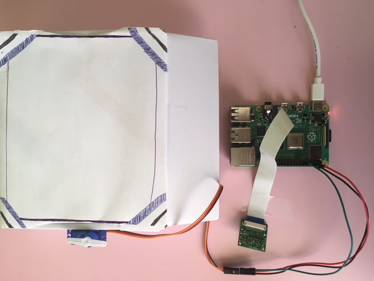
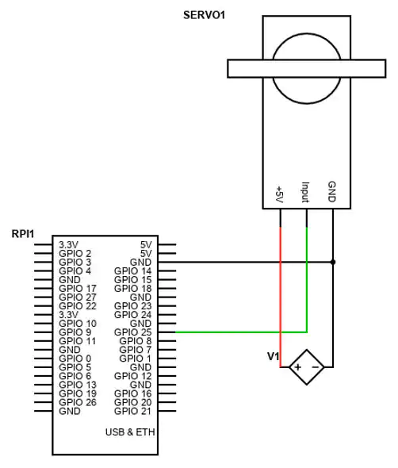

# Password-Protected Image Recognition
The intention of this project is to read an image, process its contents, and produce a description of the percentage possibility of several different objects being in that image. The image is taken by the Raspberry PiCamera2. I extended this project further than this original intent, but it has even greater applications.

| **Engineer** | **School** | **Area of Interest** | **Grade** |
|:--:|:--:|:--:|:--:|
| Nidhi L. | Basis Independent Silicon Valley | Computer Science | Rising Junior       

# My Finished Project

 
# Demo Night

# Final Milestone
  As a part of my final milestone, I linked the machine learning model processing the images to the movement of the servo motor shaft. I also attached this shaft to     the edge of box so that it will simulate a lock on the box. I used the image recognition ability of the model to have recognize a certain pattern of objects that the   Raspberry Pi Camera captured. Once the model processed the captured images, the main code checked whether the named objects were in the password, which I defined       before. If the objects' names matched, the servo motor shaft, simulating a "lock", turns 90 degrees exactly over the box lid to lock it. At this point, I have         accomplished the final step of my base project and my modifications to it.

<iframe width="560" height="315" src="https://www.youtube.com/embed/l1_Vb763a3Q" title="YouTube video player" frameborder="0" allow="accelerometer; autoplay; clipboard-write; encrypted-media; gyroscope; picture-in-picture" allowfullscreen></iframe>

# Second Milestone
  As a part of my second milestone, I connected the servo motor to the Raspberry Pi microcontroller board using 3 GPIO pins on the Raspberry Pi board because the servo   motor requires 3 connections: the ground (GND - black), the 5 V supply (red), and the pulse width modulation signal (PWM - orange), which controls the clockwise and   counterclockwise movement of the servo shaft a certain number of degrees.  At this extent of the project, I wrote Python code for the servo motor to facilitate the     movement of the servo motor shaft from 0 to 180 degrees and back again. Find out what my next steps are in the video!

<iframe width="560" height="315" src="https://www.youtube.com/embed/yPYlxmPScQ0" title="YouTube video player" frameborder="0" allow="accelerometer; autoplay; clipboard-write; encrypted-media; gyroscope; picture-in-picture" allowfullscreen></iframe>
 
 

# First Milestone
  As a part of my first milestone, I set up the Raspberry Pi, installed tensorflow (a library of machine learning models),    downloaded a sample machine learning       model, and configured this model to process images being produced from the Raspberry Pi Camera, which I also connected. At this point in my project, the Raspberry     Pi camera can take a static picture and the model can process the image, outputting the top 5 items of highest probability that seems to appear in the image. The       final achievement of this milestone is that the Raspberry Pi camera can now capture a live feed, which the model can process. Thus, any object that the camera is       pointing at in the live feed can be identified as the greatest probability match of the top 5 items. Find out what my next steps are in the video!  

<iframe width="560" height="315" src="https://www.youtube.com/embed/HjJp5JbvUPY" title="YouTube video player" frameborder="0" allow="accelerometer; autoplay; clipboard-write; encrypted-media; gyroscope; picture-in-picture" allowfullscreen></iframe>

 
# Bill of Materials
 
 | **Software Configuration** | **Hardware Configuration** |
 | -------------------------- | -------------------------- |
 |  Debian GNU/Linux 11 (bullseye) aarch64 | Raspberry Pi Camera        |
 |  Kernel Version 5.15.32-v8+| 32GB SD Card               |
 |  Python 3.9.2 64-bit       | Raspberry Pi4 Model B 2GB Microcontroller Board |
 |  PiCamera2 0.2.3           | Servo Motor                | 
 |  Tflite-runtime 2.9.1      | Jumper Wires               |
 
 

# [Link to my Code](https://github.com/nidhilawange/Object-Detection-Lock)

# Servo Motor Connection Schematic

 

